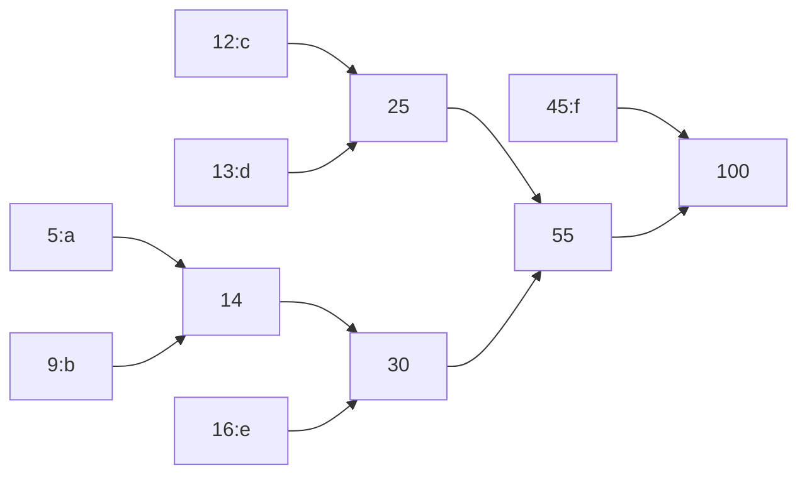

# 哈夫曼建树示例

下面用一个经典的小例子展示如何用最小堆构建 Huffman 树，逐步展示堆的状态与每次合并。

示例频率（字符: 频率）：
- a: 5
- b: 9
- c: 12
- d: 13
- e: 16
- f: 45

初始将每个符号作为叶子节点加入最小堆（按频率最小优先）：

堆（按频率升序列出）：
- [5:a], [9:b], [12:c], [13:d], [16:e], [45:f]

步骤 1：弹出两个最小节点 5(a) 与 9(b)，合并为父节点 14
- 合并：p1(freq=14, left=5(a), right=9(b))
- 将 p1 插回堆
- 堆现在： [12:c], [13:d], [14:p1], [16:e], [45:f]

步骤 2：弹出 12(c) 和 13(d)，合并为父节点 25
- 合并：p2(freq=25, left=12(c), right=13(d))
- 堆现在： [14:p1], [16:e], [25:p2], [45:f]

步骤 3：弹出 14(p1) 和 16(e)，合并为父节点 30
- 合并：p3(freq=30, left=14:p1, right=16:e)
- 堆现在： [25:p2], [30:p3], [45:f]

步骤 4：弹出 25(p2) 和 30(p3)，合并为父节点 55
- 合并：p4(freq=55, left=25:p2, right=30:p3)
- 堆现在： [45:f], [55:p4]

步骤 5：弹出 45(f) 和 55(p4)，合并为根节点 100
- 根：root(freq=100, left=45:f, right=55:p4)
- 堆现在只剩根，建树完成。

由此可以生成编码（左边为 0，右边为 1），例如：
- f 的路径为 0 -> code 0
- a 的路径为 1100 -> code 1100 （取决于合并时左右孩子的选择）

注意：当频率相同或堆实现中左右孩子选择不唯一时，某些编码可能和其他实现不同，但解码仍然正确。

---

下面是一个简单的 mermaid 图，表示合并的高层流程（查看器支持 mermaid 时可渲染）：

如果你希望我把这个示例插入到 `README.md` 中，或生成更详尽的每一步堆数组索引示意（数组下标和上浮/下沉动画式说明），我可以继续补充。